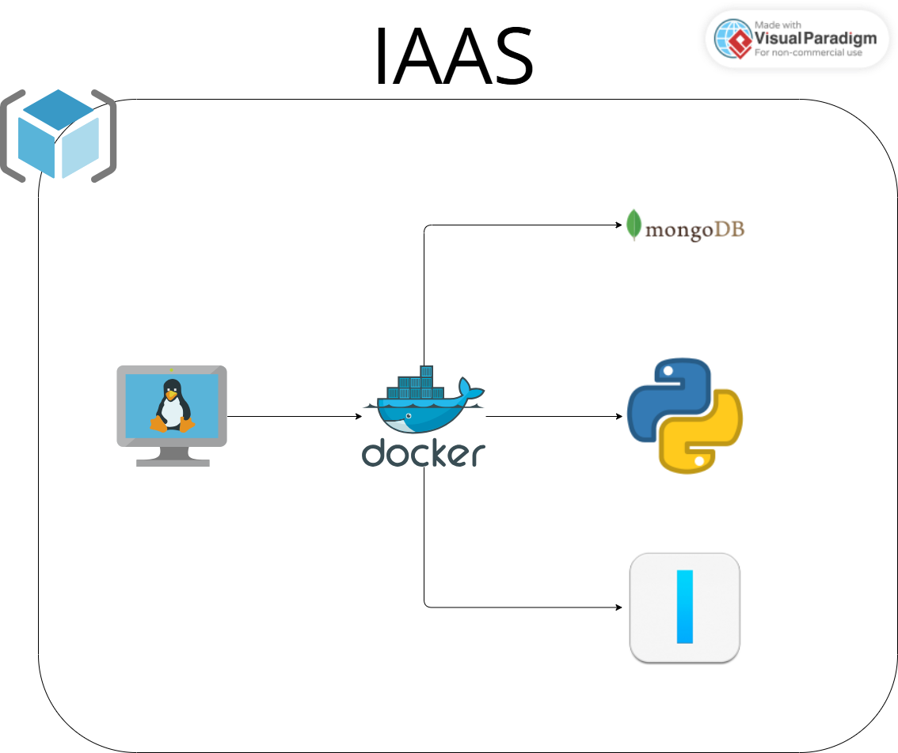
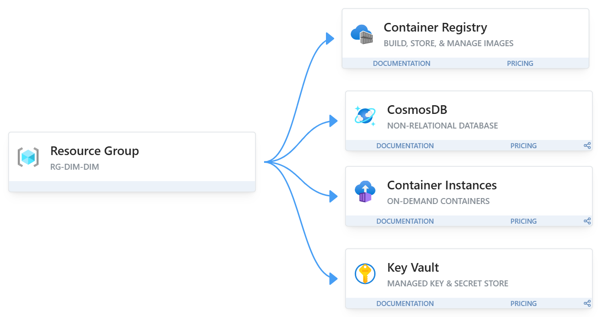

# $DEVOPS-CLOUD-CP04-LOCALHOST$

Migração completa para Docker Compose

## **Objetivo**

Atualizar a arquitetura de forma eficiente, com auxilio do docker compose para automatizar e orquestrar a criação de containers.

## 1. **Projeto e arquitetura**

O Shopping enfrentava dificuldades em analisar dados de vendas e clientes. A DimDim propôs uma solução de IA Generativa para potencializar decisões, reduzindo custos e aumentando eficiência.

Primeiro passo foi criar um ambiente DEV em cloud para:

- Armazenar dados: MongoDB, banco de dados NoSQL
- Manipular os registros: API Python
- Processamento NLP: Ollama, permite rodar LLMs de ponta sem precisar de acesso à internet ou de serviços em nuvem
  > imagem oficial ollama/ollama

### _Atual - IAAS_

Temos a arquiteturas com o conceito de IAAS, usando uma VM na azure rodando 3 containers

> mais controle, mas mais trabalho (manutenção, updates, dependências).



#### _Dependências_

- API -> depende de Mongo e do Ollama
- Ollama -> depende de imagem + modelo LLM

### _Futura - PAAS_

Será feito o uso de PAAS, onde teremos em nosso grupo de recursos:

1. CosmosDB: Banco de dados NoSQL, que substitui o mongoDB | persistência de dados
2. Azure Container Registre `ACR`: Armazena nossas imagens personalizadas | ontrole de versionamento e segurança de imagens
3. Azure Container Instance `ACI`: Responsável por rodar nossa aplicação python e o ollama
4. Key Vault: Guarda todas as senhas de forma semelhante a variáveis de ambiente, usamos para acessar o banco ou instanciar o container | proteção de credenciais

> mais abstração, menos manutenção, mais agilidade.



#### _Dependências_

- API -> depende do CosmosDB e do Ollama
- Ollama -> depende de imagem + modelo LLM
- API/CosmosDB -> credenciais vindas do Key Vault

---

## 2. Implementação do Docker Compose

### Serviços necessários

- datalk-api: aplicação FastAPI [Dockerfile](./api/Dockerfile)
- ollama: processamento de LLM (imagem oficial ollama/ollama)
- mongo: banco NoSQL (imagem oficial mongo:7)

### Configuração de redes para comunicação entre os containers

- Docker compose cuida dessa parte e cria uma para todos os containers

### Gerenciamento de volumes

Volumes nomeados:

```yaml
volumes:
  datalk_mongo:
  datalk_ollama:
```

#### Mapeamentos:

- datalk_ollama:/root/.ollama → persistência de modelos Ollama
- datalk_mongo:/data/db → persistência de dados MongoDB
- ./api:/app → código da API (desenvolvimento)
- 📌 Python: Ingestão de dados: - ./data:/data - ./ingest:/ingest
  > Não interferem na api ou possuem função de persistência de dados, foram usados para copiar as pastas com dataset e código para popular o banco de dados.

### Variáveis de ambiente para a configurações

No modelo atual, as configurações de conexão estão fixas no código.

### Políticas de restart

Ambiente DEV usamos `unless-stopped` que sempre reinicia, exceto se forem parados manualmente.

### Exposição das portas necessárias

- ollama -> 11434:11434
- mongoDB -> 27017:27017
- python -> 8000:8000

### Health checks para monitoramento dos serviços críticos

Health checks assegura que os serviços estão rodando de forma funcional

```yaml
healthcheck:
  test: ["CMD", ...]
  interval: 30s
  timeout: 10s
  retries: 3
```

### Utilizar usuário sem privilégios administrativos para executar o App

Modelo atual roda como root

## 3. Deploy

### Clone do repositório

```bash
git clone https://github.com/Entrega-CheckPoint/DEVOPS-CLOUD-CP04-LOCALHOST

cd DEVOPS-CLOUD-CP04-LOCALHOST
```

### Subir o container

```bash
docker compose up -d --build

docker compose logs -f
```

### Baixar modelo `mistral`

```bash
docker exec -it ollama ollama pull mistral
```

### Conferir a aplicação

[http://localhost:8000/docs#/](http://localhost:8000/docs#/)

### Troubleshooting básico

- API não sobe:
  Verifique logs com docker compose logs datalk-api

- Erro de conexão com MongoDB:
  Confirme se o container mongo está rodando com docker ps

- Ollama não responde:
  Confirme se o modelo foi baixado (docker exec -it ollama ollama list)
  Verifique logs da api com docker compose logs datalk-api

## Link do video

[CP04 - Video](https://www.youtube.com/watch?v=mSqR44Tojyk)
